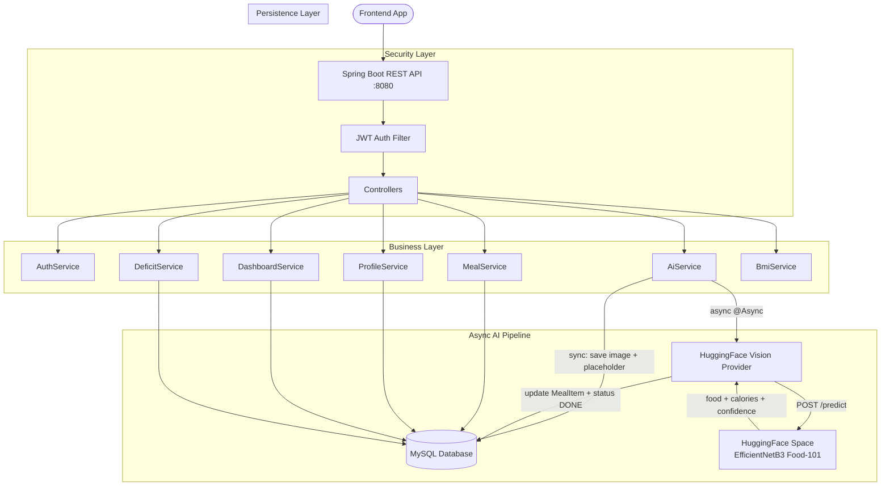
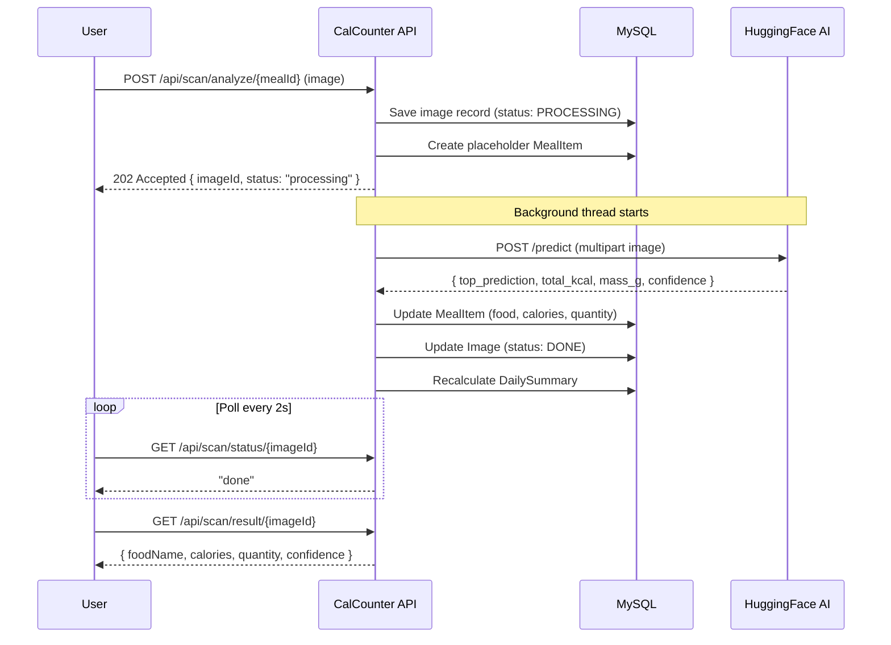

<div align="center">


<br/>

**Production-ready REST API for intelligent nutrition tracking with AI-powered food recognition.**  
Upload a meal photo — let the AI identify the food, calculate calories, and log it automatically.

<br/>


[](https://github.com/MahmoudYoussef-web)
[](https://github.com/MahmoudYoussef-web)
[](https://github.com/MahmoudYoussef-web)

</div>

---

## 📋 Table of Contents

- [Overview](#-overview)
- [System Architecture](#-system-architecture)
- [AI Food Scan Flow](#-ai-food-scan-flow)
- [Features](#-features)
- [API Reference](#-api-reference)
- [Database Schema](#-database-schema)
- [Tech Stack](#-tech-stack)
- [Getting Started](#-getting-started)
- [Authors](#-authors)

---

## 🌐 Overview

**CalCounter** is a health & nutrition tracking backend that solves the hardest problem in calorie tracking — making it effortless. Instead of manually searching food databases, users simply photograph their meal. An **EfficientNetB3 AI model** identifies the food, estimates its weight, and calculates calories — all asynchronously in the background.

### What sets this apart from a typical CRUD API?

| Challenge | How CalCounter solves it |
|---|---|
| Manual food logging is tedious | **AI Vision** — photo → food name + calories automatically |
| AI response latency blocks the user | **Async processing** — returns immediately, frontend polls for result |
| AI service cold-start timeouts | **Configurable RestTemplate timeout** (30s connect / 120s read) |
| Retry on AI failure | **Retry endpoint** reads image from disk, re-sends to AI |
| Calorie goal varies per person | **Mifflin-St Jeor formula** calculates personal daily target |
| Tracking consistency across meals | **DailySummary auto-updated** on every meal change |

---

## 🏗️ System Architecture



**Communication:**
- `───►` Synchronous (blocking REST call)
- `- - ►` Asynchronous (Spring `@Async` background thread)

---

## 🔄 AI Food Scan Flow

When a user uploads a food photo, a non-blocking pipeline handles the entire analysis:



---

## ✨ Features

<details>
<summary><strong>🔐 Authentication & Security</strong></summary>

- Register & login with username or email
- JWT-based stateless authentication
- BCrypt password hashing
- All endpoints protected — public only: `/auth/**`

</details>

<details>
<summary><strong>👤 User Profile & Health Metrics</strong></summary>

- Store age, weight, height, gender, activity level, fitness goal
- Auto-calculate daily calorie target via **Mifflin-St Jeor** equation
- BMI calculation with category (Normal / Overweight / Obese)
- Calorie deficit management with projection to goal weight

</details>

<details>
<summary><strong>🍽️ Meal Tracking</strong></summary>

- Create meals by type: `BREAKFAST` / `LUNCH` / `DINNER`
- Add food via AI scan or manual entry
- Update & delete meal items — daily summary auto-recalculates
- Query all meals by date

</details>

<details>
<summary><strong>🤖 AI Food Recognition</strong></summary>

- Upload food photo → async AI analysis
- Detects: food name · calories · estimated weight · confidence score
- Retry failed scans (re-reads image from disk)
- Image gallery with favorite & delete support

</details>

<details>
<summary><strong>📊 Dashboard & Progress</strong></summary>

- Daily: consumed vs target calories, remaining, status
- Weekly: 7-day calorie chart
- Weight progress: current → target with percentage
- Exercise progress: weekly workout days tracked

</details>

---

## 📡 API Reference

All endpoints prefixed with `/api` · Full interactive docs at `/swagger-ui/index.html`

| Method | Endpoint | Description |
|---|---|---|
| `POST` | `/auth/register` | Create account |
| `POST` | `/auth/login` | Login → JWT |
| `GET` | `/profile` | Get full profile |
| `PUT` | `/profile` | Update profile |
| `POST` | `/meals` | Create meal |
| `GET` | `/meals/by-date` | Get meals by date |
| `GET` | `/meals/daily-calories` | Total calories for day |
| `POST` | `/meals/{id}/items/manual` | Add food manually |
| `PUT` | `/meals/items/{id}` | Update meal item |
| `DELETE` | `/meals/items/{id}` | Delete meal item |
| `POST` | `/scan/analyze/{mealId}` | **Upload food image → AI** |
| `GET` | `/scan/status/{imageId}` | Poll AI status |
| `GET` | `/scan/result/{imageId}` | Get AI result |
| `POST` | `/scan/retry/{imageId}` | Retry failed scan |
| `GET` | `/scan/gallery` | Browse scanned images |
| `GET` | `/dashboard/daily` | Daily summary |
| `GET` | `/dashboard/weekly` | Weekly chart data |
| `GET` | `/bmi/status` | Current BMI |
| `POST` | `/bmi/calculate` | Calculate BMI |
| `GET` | `/deficit/projection` | Time to reach goal weight |
| `POST` | `/workout/log` | Log exercise day |
| `GET` | `/progress/weight` | Weight progress % |
| `GET` | `/progress/exercise` | Exercise progress % |

---

## 🗄️ Database Schema

<p align="center">
  
</p>

---

## 🛠️ Tech Stack

| Layer | Technology | Purpose |
|---|---|---|
| Language | Java 21 | Core language |
| Framework | Spring Boot 3 | Application framework |
| Security | Spring Security + JJWT | Stateless JWT auth |
| Persistence | Spring Data JPA / Hibernate | ORM & DB access |
| Database | MySQL 8 | Primary data store |
| Async | Spring `@Async` + Thread Pool | Non-blocking AI processing |
| AI Client | RestTemplate | HTTP calls to HuggingFace |
| AI Model | EfficientNetB3 / Food-101 | Food classification (101 classes) |
| Docs | SpringDoc OpenAPI 3 | Swagger UI |
| Build | Maven | Dependency management |
| Utilities | Lombok | Boilerplate reduction |

---

## 🚀 Getting Started

### Prerequisites
- Java 21+
- MySQL 8+
- Maven 3.8+

### Setup

```bash
# 1. Clone
git clone https://github.com/MahmoudYoussef-web/calorie-tracker-backend.git
cd calorie-tracker-backend

# 2. Create database
mysql -u root -p -e "CREATE DATABASE Calories_Calculation_System;"
```

```properties
# 3. Configure src/main/resources/application.properties
spring.datasource.url=jdbc:mysql://localhost:3306/Calories_Calculation_System
spring.datasource.username=your_username
spring.datasource.password=your_password

jwt.secret=your_strong_secret_key_min_32_chars
jwt.expiration-ms=86400000

ai.provider=huggingface
ai.huggingface.url=https://mostafaelsayed04-food-detection.hf.space
```

```bash
# 4. Run
mvn spring-boot:run

# 5. Open Swagger UI
open http://localhost:8080/swagger-ui/index.html
```

---

## 👥 Authors

<table>
  <tr>
    <td align="center" width="300">
      <b>Mahmoud Youssef</b><br/>
      <sub>Backend Engineer</sub><br/><br/>
      <a href="https://github.com/MahmoudYoussef-web">
        
      </a>
    </td>
    <td align="center" width="300">
      <b>Mahmoud Mohamed</b><br/>
      <sub>AI Engineer</sub><br/><br/>
      <a href="https://github.com/mabdelmageedali">
        
      </a>
    </td>
  </tr>
</table>

---

<div align="center">
  <sub>Built with ❤️ as a graduation project · Open to international opportunities</sub>
</div>